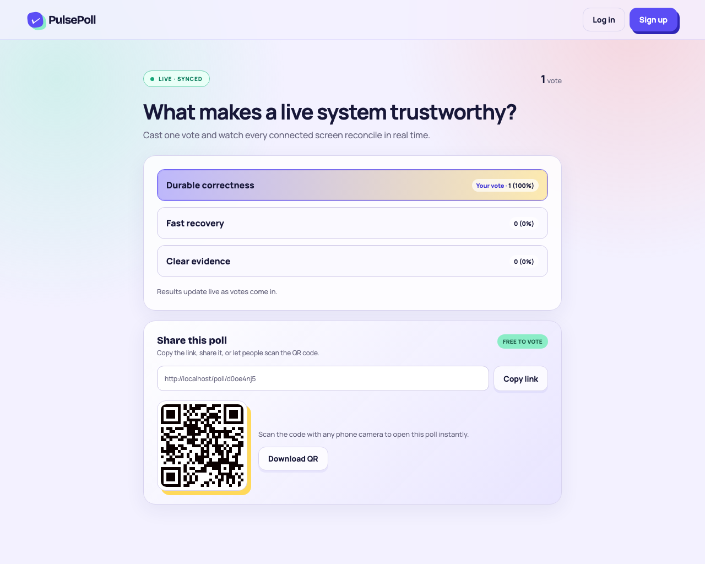
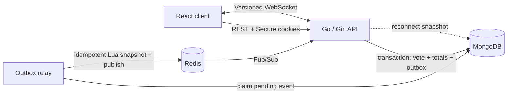

# PulsePoll

PulsePoll turns one question into a shared live moment: create a poll, share a link or QR code, and watch versioned results move across every connected screen.



This repository is deliberately **production-shaped, not production-claimed**. MongoDB is the durable acceptance boundary, Redis owns the hot snapshot and multi-instance fan-out, and reconnecting clients repair themselves from a versioned REST snapshot. The included free-tier deployment is suitable for an evaluation demo, not an SLA.

## What reviewers can prove

- Sign up, sign in, sign out, and manage only your own polls.
- Create 2–10 unique options, optionally schedule closing, share by URL/QR, close/reopen, archive, and export CSV.
- Accept at most one vote per browser identity through a unique MongoDB index.
- Commit the vote, count/version update, and outbox event in one transaction.
- Apply every outbox event to Redis once with Lua, then publish it to WebSocket viewers.
- Recover from a missed event or reconnect by replacing client state from the durable snapshot.
- Keep an accepted vote safe when Redis is unavailable; the relay retries with bounded exponential backoff.
- Withhold results before voting unless the host explicitly enables early results.
- Diagnose the service through request IDs, JSON logs, `/api/livez`, `/api/readyz`, and dependency-free JSON metrics at `/api/metrics`.

## Architecture



The synchronous vote request ends only after MongoDB commits. Redis work is asynchronous. That makes the promise precise: **live delivery can be delayed; an accepted vote cannot be lost because Redis failed.** See [Architecture](docs/ARCHITECTURE.md) for invariants and the failure matrix.

## Run locally

Prerequisite: Docker Desktop.

```bash
git clone https://github.com/ekanathan246-maker/pulsepoll.git
cd pulsepoll
docker compose up --build
```

Open [http://localhost](http://localhost). Compose starts a single-node MongoDB replica set (transactions), persistent Redis, the Go API, and nginx-hosted React UI.

Useful checks:

```bash
curl --fail http://localhost/api/livez
curl --fail http://localhost/api/readyz
docker compose logs -f backend
```

No API key or paid dependency is required. Local demo data stays in Docker volumes.

## Verification

Frontend:

```bash
cd frontend
npm ci
npm test
npm run build
npm run test:e2e
```

Backend without a host Go installation:

```bash
docker run --rm -v "$PWD/backend:/app" -w /app golang:1.27-alpine go test ./...
```

Concurrency gate while Compose is running:

```bash
docker run --rm \
  -e PULSEPOLL_BASE_URL=http://host.docker.internal \
  -v "$PWD/backend:/app" -w /app golang:1.27-alpine \
  go test -tags=integration ./tests -count=1 -v
```

That test launches 100 concurrent browser identities, retries every ballot, and requires exactly 100 durable votes with version 101. Playwright separately proves live fan-out between isolated host and guest contexts on desktop and mobile.

Load test:

```bash
k6 run -e BASE_URL=http://localhost -e POLL_SLUG=<slug> -e OPTION_ID=<id> loadtest/vote.js
```

Targets are evaluation goals, not free-tier promises. Record region, hardware, warm/cold state, and the raw k6 summary with any published result.
For a reproducible local run that creates its own poll and rejects count drift, use `scripts/run-local-loadtest.sh`. The latest checked-in raw result and environment notes are under `docs/evidence/`.

Seed or reset the reproducible local interview demo:

```bash
scripts/demo.sh seed
scripts/demo.sh reset
```

The script refuses to seed a remote URL with its local-only default password. See [Demo script](docs/DEMO_SCRIPT.md) for the presentation flow.

## Repository map

```text
backend/
  cmd/server/                 composition root and graceful shutdown
  internal/auth/              opaque hashed sessions and CSRF credentials
  internal/domain/            poll validation and normalization
  internal/handlers/          REST and WebSocket transport
  internal/platform/httpx/    bounded strict JSON decoder
  internal/realtime/          Redis Lua application, Pub/Sub, outbox relay
  tests/                      concurrent API integration test
frontend/
  src/pages/                  product flows
  src/components/             result and sharing modules
  e2e/                        two-viewer Playwright proof
docs/                         architecture, deployment, interview, API contract
loadtest/                     k6 vote-burst scenario
.github/workflows/ci.yml      unit, race, build, audit, integration, browser gates
```

## Security choices

- Passwords use Argon2id; browser sessions and CSRF tokens are random, opaque, and stored only as SHA-256 hashes.
- The session cookie is `HttpOnly`, `Secure` in production, and `SameSite=Lax`; state-changing owner actions also require the CSRF header.
- CORS and WebSocket origins use an exact allowlist or verified same origin.
- JSON bodies are bounded, allow only known fields, and receive domain validation after decoding.
- Auth and voting have Redis-backed rate limits that deliberately fail open if Redis is unavailable; Redis must never become the durable vote boundary.
- Public responses and CSV exports do not expose voter IDs, user agents, session data, or password hashes.

The browser token prevents casual repeat voting; it is not proof of one human. Clearing browser storage or changing browsers can produce another identity. That limitation is stated instead of hidden.

## Deploy

The included `render.yaml` and multi-stage `deploy/combined.Dockerfile` deploy the React UI, nginx proxy, and Go API as one Render service. Use MongoDB Atlas and a TLS Redis URL (for example Upstash) on their free tiers. Exact instructions and rollback checks are in [Deployment runbook](docs/DEPLOYMENT.md).

The release image is also built in CI and asserted to run as UID/GID `101:101` rather than root.

Required production variables:

| Variable | Purpose |
|---|---|
| `MONGO_URI` | Atlas URI with transaction support |
| `MONGO_DB` | Database name, normally `pulsepoll` |
| `REDIS_URL` | `rediss://` TLS Redis URL |
| `FRONTEND_ORIGINS` | Exact public origin(s) |
| `PUBLIC_URL` | Canonical URL used by QR/share links |

Never commit secrets. `.env.example` contains names and safe local examples only.

## Interview handoff

- [Architecture and failure matrix](docs/ARCHITECTURE.md)
- [Deployment and rollback runbook](docs/DEPLOYMENT.md)
- [3–5 minute demo script](docs/DEMO_SCRIPT.md)
- [Interview questions and honest trade-offs](docs/INTERVIEW_GUIDE.md)
- [OpenAPI contract](docs/openapi.yaml)
- [Measured local load evidence](docs/evidence/README.md)

## License

MIT — see [LICENSE](LICENSE).
