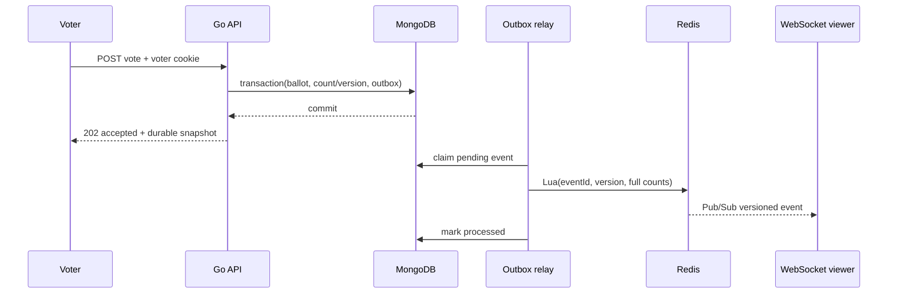

# Architecture decision: durable-first live voting

Status: accepted

## Context

PulsePoll must feel immediate without pretending an in-memory system is durable. Redis Pub/Sub is at-most-once delivery and a free Redis database can restart. MongoDB transactions and unique indexes provide the correctness boundary reviewers can inspect and test.

## Decision

An accepted vote is a MongoDB transaction containing three writes:

1. Insert a ballot under the unique `(poll_id, voter_id)` index.
2. Increment the selected option and monotonic poll version.
3. Insert a versioned outbox event with the complete count snapshot.

The API responds `202` only after that transaction commits. An in-process relay claims pending events, uses a Redis Lua script to apply each `event_id` once, replaces the count hash/version/status, and publishes the same versioned event. Multiple API replicas subscribe to the shared channel and forward events over WebSocket.

## Invariants

- A response marked `accepted: true` has one durable ballot and count increment.
- `(poll_id, voter_id)` can exist at most once, including under concurrent retries.
- A poll version increases once per accepted vote or status change.
- Redis never has authority to accept a ballot.
- Outbox delivery may repeat; `event_id` application is idempotent.
- A full snapshot may jump versions safely. A client event may not: any gap triggers REST reconciliation.
- A slow or disconnected viewer cannot delay vote acceptance.

## Vote sequence

## Failure matrix

| Failure | User-visible result | Recovery |
|---|---|---|
| Redis unavailable during vote | Vote still returns accepted after Mongo commit; live badge can reconnect | Outbox retry with exponential backoff applies the full snapshot later |
| MongoDB unavailable | Vote is not accepted | Short request deadline and retry guidance; Redis is untouched |
| Duplicate HTTP request | `409 duplicate_vote`; count unchanged | Unique compound index is authoritative |
| Relay repeats an event | No duplicate increment or notification | Lua checks the 24-hour applied-event key and version |
| Viewer misses Pub/Sub | Reconnecting state | Initial WebSocket snapshot and REST fetch replace local state |
| Viewer receives a version gap | Brief reconciliation | Client fetches the durable snapshot instead of guessing deltas |
| Slow viewer | That socket reconnects | Bounded Redis channel and write deadlines protect the process |
| API receives SIGTERM | New traffic stops; in-flight HTTP gets a bounded drain | Context cancellation stops relay and connections close |

## Security model

Accounts use Argon2id hashes. Login creates an opaque session and CSRF credential; only their SHA-256 hashes are stored. Cookies are same-site and secure in production. Cross-origin REST and WebSocket handshakes require an exact configured origin. Request bodies are capped and unknown fields are rejected.

Anonymous voter identity is deliberately described as abuse friction. A browser can clear its cookie or use another browser. Stronger one-person guarantees require identity verification and a different privacy/product contract.

## Rejected alternatives

**Redis `INCR` before MongoDB:** fast but can acknowledge a vote that is later lost. It makes failure semantics impossible to defend.

**Write MongoDB then publish directly:** durable, but a crash between commit and publish leaves viewers stale indefinitely. The transactionally inserted outbox closes that gap.

**Redis Streams for the first release:** stronger delivery primitives but more consumer-group operations than this evaluation needs. The outbox is the durable queue; Pub/Sub is intentionally ephemeral fan-out.

**SSE:** simpler for server-to-client updates, but the assignment plan asks for explicit WebSocket lifecycle behavior. WebSocket ping/pong also makes dead-client handling visible.
